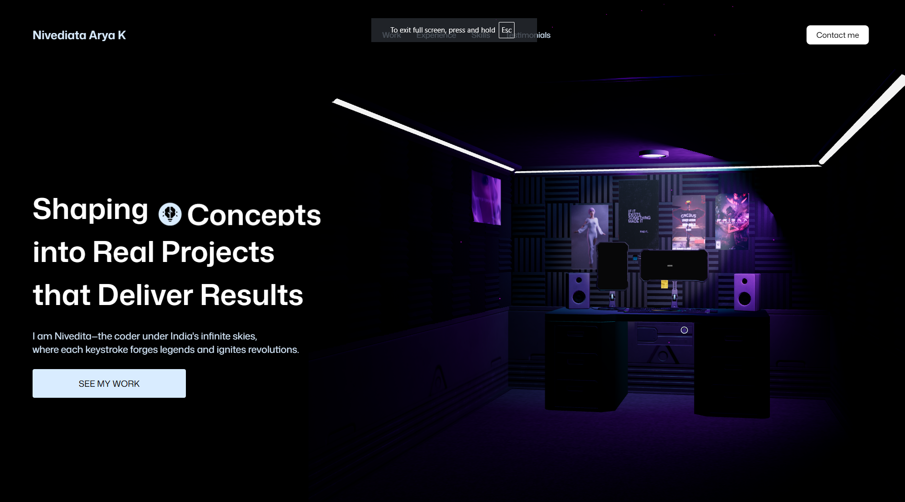

# Nivedita Arya K — Portfolio

Welcome to the repository for my personal portfolio. This project showcases my work, skills, and experience in a highly visual manner, featuring a custom studio-like interface.

---

## Overview

- **Name**: Nivedita Arya K
- **Goal**: Shaping concepts into real projects that deliver results
- **Description**: I’m Nivedita—the coder under India’s infinite skies, where each keystroke forges legacies and ignites revolutions.

This portfolio website is designed to give visitors a glimpse of my creative process, highlight my projects, and provide context for my professional background. Below is a screenshot of the landing page:

---

## Screenshot



---

## Features

- **Dark Aesthetic**: A sleek, modern, dark-themed interface.
- **Responsive Design**: Optimized for viewing on various devices (desktop, tablet, mobile).
- **Clean Architecture**: Organized folder structure and modular code.
- **Contact Section**: Quick and convenient means to get in touch.

---

## Tech Stack

- **Front End**: HTML5, CSS3 (SCSS), JavaScript (ES6+)
- **Frameworks/Libraries**: [React](https://reactjs.org/) (if applicable), [Bootstrap](https://getbootstrap.com/) (optional)
- **Back End**: Node.js/Express (if applicable)
- **Hosting**: GitHub Pages, Vercel, or Netlify (depending on your choice)

---

## Getting Started

1. **Clone the repository**:
   ```bash
   git clone https://github.com/YourUsername/portfolio.git
   ```
